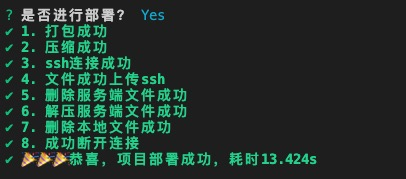

# amazing-tools
record: 工作中使用的一些方法以及有意思的问题解决方案
> 两位小数正则校验
判断是否安卓 : navigator.userAgent 
时间格式化


### deploy.js
> 打包上传SSH文件

执行命令： `node deploy.js --mode dev`



### 前端常用工具
1. 全局监听图片错误并替换到默认图片
```js
window.addEventListener("error", e => {
    /** 默认`base64`图片 */
    const defaultImg = 'data:image/png;base64,iVBORw0KGgoAAAANSUhEUgAAACAAAAAgCAYAAABzenr0AAABsUlEQVRYR83XO2gVQRTG8V/AUjvttBMf2AQsxBcSO0EtxIhga2GjTcokJEGxERstrOysFFQQUgkqqL2FL5LSQlMEu0Aa5Vx2JWz2MTdZd+/AbXa/Od//njl7ZmZMz2OsZ38jAzCPMx1n4x3mIwNPcK1j89xuALCCPT0BrAbAn57MB7ZtAvzCDxwd5g+1BbAQBZUZB8AcLqSAtAHwFhMFs5N43ydAeCfV1v/KwHm8ajMDn3GkJuBL3MM3XMYUDrQB8Cwrri/YhavZ72xK8BRN3RKE+ZWKII9wI8WgSVMF8BOnsVwRYAeil59oMmh6XwVwCw8bJh/Da+xsMql7XwbwFeNYTwg8g9s1ulU8x/UqTRnANO4mmOeSqPyDJfr7mMUaduMxLhZ1ZQCH8H0IgKiDDwX9C1wqPDuOj00AEejUEOa5dBJPN8w7nPWEYqjQhPbfKGbgTpa2LTAMpsSGFAecqq9nU4csAkSDebNV98R5S9ifazcCxF6+LzHIdmQPcLMMoK7zbcewOPccFssAYl/vauzNl2EkDqV9HssX8ptR1xeT3/iUX0y6WvdSn5G5G/aWhb/64VTmIS34xwAAAABJRU5ErkJggg==';
 
    const node = e.target;
    if (node.nodeName && node.nodeName.toLocaleLowerCase() === "img") {     
        node.style.objectFit = "cover";
        node.src = defaultImg;
    }
}, true);

```

2. 复制
```js
/**
 * @description: 复制内容
 * @param {} 
 * @return void 
 */
copyInputValue = () => {
    // 兼容 ios 安卓
    let input = document.createElement("input");
    input.value = "复制的内容balabala";
    document.body.appendChild(input);
    input.select();
    input.setSelectionRange(0, input.value.length), document.execCommand('Copy');
    document.body.removeChild(input);
    console.log("复制成功")
};
```

`setSelectionRange(start: number, end: number)  // 兼容 ios 和 IE `